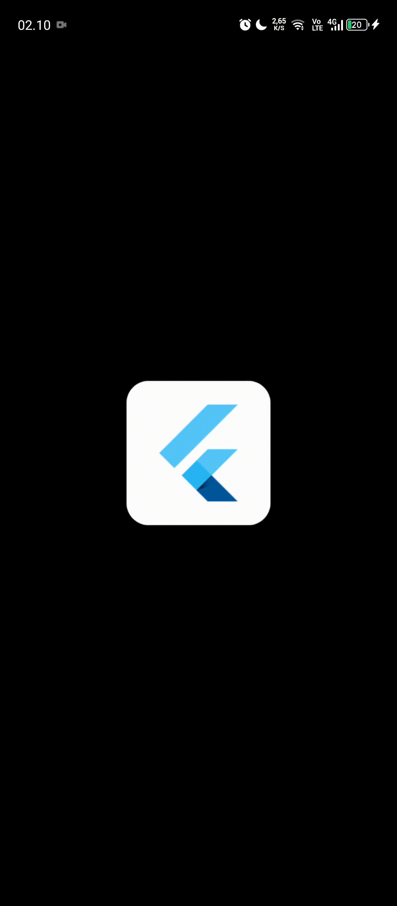

# Laporan Praktikum

---

## Jawaban Soal

### **Cobalah klik setiap button, apa yang terjadi?**

1. Ketika tombol **"Neon Blue"** ditekan:

   - Halaman kedua akan tertutup.
   - **Halaman utama akan berubah warna menjadi neon blue** (`0xFF007AFF`).
   - **Warna AppBar dan latar belakang** halaman utama ikut berganti.

2. Ketika tombol **"Soft Cyan"** ditekan:

   - Halaman kedua akan tertutup.
   - **Halaman utama berubah warna menjadi soft cyan** (`0xFF00A9A5`).
   - **AppBar dan background** halaman utama ikut berganti warna.

3. Ketika tombol **"Electric Purple"** ditekan:
   - Halaman kedua tertutup.
   - **Warna halaman utama berubah menjadi electric purple** (`0xFF8A2BE2`).
   - **AppBar dan latar belakang** halaman utama ikut menyesuaikan warna yang dipilih.

---

### **Mengapa demikian?**

1. **Warna yang dipilih dikembalikan ke halaman utama menggunakan `Navigator.pop(context, color);`.**
2. **Halaman utama menerima warna yang dipilih lewat fungsi `_navigateAndGetColor()` dan menjalankan `setState()` untuk memperbarui tampilan.**
3. **Proses `setState()` membuat halaman utama dirender ulang dengan warna baru berdasarkan pilihan dari halaman kedua.**

---

**Kesimpulan:**  
**Setiap kali salah satu tombol di halaman kedua diklik, halaman utama akan langsung menyesuaikan warna sesuai dengan warna yang dipilih.**  
**Hal ini bekerja karena data warna dikirim melalui `Navigator.pop()`, kemudian diproses dan diperbarui pada halaman utama dengan bantuan `setState()`.**

## Dokumentasi Laporan

## 
