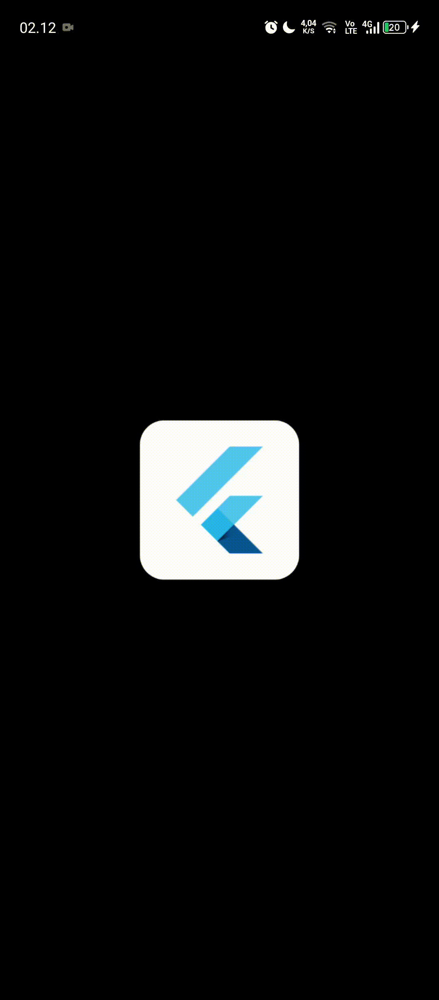

# Laporan Praktikum

---

## Jawaban Soal

### **Cobalah klik setiap button, apa yang terjadi?**

1. Ketika tombol **"Neon Blue"** ditekan:

   - Latar belakang halaman utama langsung berubah ke warna **Neon Blue** (`0xFF007AFF`).
   - Setelah memilih warna, dialog akan tertutup.

2. Ketika tombol **"Soft Cyan"** ditekan:

   - Latar belakang halaman utama berubah ke warna **Soft Cyan** (`0xFF00A9A5`).
   - Dialog akan menutup setelah warna dipilih.

3. Ketika tombol **"Electric Purple"** ditekan:

   - Warna latar belakang halaman utama berubah menjadi **Electric Purple** (`0xFF8A2BE2`).
   - Dialog tertutup setelah pemilihan warna.

4. Jika tombol **"Batal"** ditekan:
   - Dialog ditutup tanpa adanya perubahan warna di halaman utama.

---

### **Mengapa demikian?**

1. **Setiap tombol warna memicu pemanggilan `setState()`, yang mengubah warna background ke warna yang dipilih.**
2. **Setelah itu, dialog ditutup menggunakan `Navigator.pop(context)`, sehingga kembali ke halaman utama dengan warna yang sudah diperbarui.**
3. **Tombol "Batal" hanya berfungsi untuk menutup dialog tanpa melakukan perubahan warna karena tidak ada pemanggilan `setState()`.**

---

## Dokumentasi Laporan

